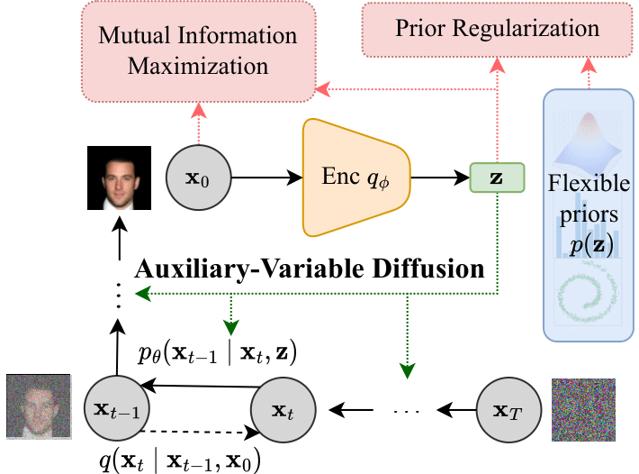
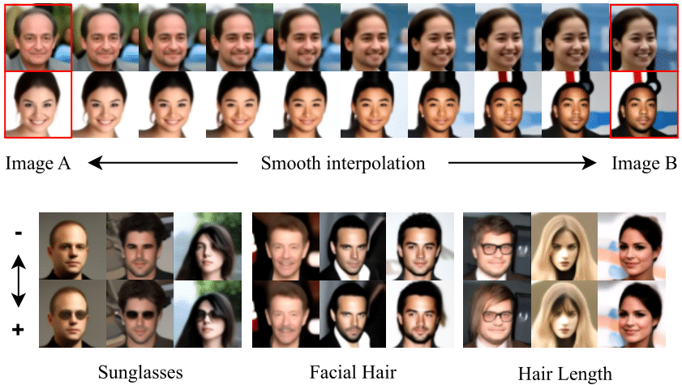

# [InfoDiffusion: Representation Learning Using Information Maximizing Diffusion Models](https://arxiv.org/abs/2306.08757)
By [Yingheng Wang](https://isjakewong.github.io/), [Yair Schiff](https://yair-schiff.github.io), [Aaron Gokaslan](https://skylion007.github.io), [Weishen Pan](https://vivo.weill.cornell.edu/display/cwid-wep4001),
[Fei Wang](https://wcm-wanglab.github.io/), [Chris De Sa](https://www.cs.cornell.edu/~cdesa/), [Volodymyr Kuleshov](https://www.cs.cornell.edu/~kuleshov/)

[]()
[](https://arxiv.org/abs/2306.08757)

<table>
  <tr>
    <td align="center">
      
    </td>
    <td align="center">
      
    </td>
  </tr>
</table>

We introduce *InfoDiffusion*, a principled probabilistic extension of diffusion models that supports low-dimensional latents with associated variational learning objectives that are regularized with a mutual information term. We show that these algorithms simultaneously yield high-quality samples and latent representations, achieving competitive performance with state-of-the-art methods on both fronts.


In this repo, we release:
* **The Auxiliary-Variable Diffusion Models (AVDM)**:
  1. Diffusion decoder conditioned on auxiliary variable using AdaNorm
  2. Simplified loss calucation for auxiliary latent variables with semantic prior
* **Baseline implementations** [[Examples]](#baselines):
  1. A set of model variants from the VAE family (VAE, \beta-VAE, InfoVAE) with different priors (Gaussian, Mixture of Gaussians, spiral).
  2. A simplified version of Diffusion Autoencoder [DiffAE](https://arxiv.org/abs/2111.15640) within our AVDM framework.
  3. A minimal and efficient implementation of vanilla diffusion models.
* **Evaluation metrics**:
  1. Generation quality: Fréchet inception distance (FID).
  2. Latent quality: latent space interpolation, latent variables for classification.
  3. Disentanglement: [DCI](https://openreview.net/forum?id=By-7dz-AZ) score, [TAD](https://link.springer.com/chapter/10.1007/978-3-031-19812-0_3) score.
* **Samplers**:
  1. [DDPM](https://proceedings.neurips.cc/paper/2020/hash/4c5bcfec8584af0d967f1ab10179ca4b-Abstract.html) sampling and [DDIM](https://arxiv.org/abs/2010.02502) sampling.
  2. Two phase sampling where these two phases samples from regular diffusion models and VADM consecutivley.
  3. Latent sampling that has an auxiliary latent diffusion model used to sample $\mathbf{z}_t$ along with $\mathbf{x}_t$.
  4. Reverse DDIM sampling to visualize the latent $\mathbf{x}_T$ from $\mathbf{x}_0$.

<a name="code-organization"></a>
## Code Organization
1. ```run.py```: Routines for training and evaluation
2. ```models.py```: Diffusion models (InfoDiffusion, DiffAE, regular diffusion), VAEs (InfoVAE, \beta-VAE, VAE)
3. ```modules.py```: Neural network blocks
4. ```sampling.py```: DDPM/DDIM sampler, Reverse DDIM sampler, Two-phase sampler, Latent sampler
5. ```utils.py```: LR scheduler, logging, utils to calculate priors
7. ```gen_fid_stats.py```: Generate stats used for FID calculation
8. ```calc_fid.py```: Calculation FID scores


<a name="getting_started"></a>

## Getting started in this repository

To get started, create a conda environment containing the required dependencies.

```bash
  conda create -n infodiffusion
  conda activate infodiffusion
  pip install -r requirements.txt
```

Run the training using the bash script:
```bash
  bash run.sh
```
or
```bash
  python run.py --model diff --mode train --mmd_weight 0.1 --a_dim 32 --epochs 50 --dataset celeba --batch_size 32 --save_epochs 5 --deterministic --prior regular --r_seed 64 
```
the arguments in this script are given to train a diffusion model `--model diff` using Maximum Mean Discrepancy (MMD) `--mmd_weight 0.1` with a regular Gaussian prior `--prior regular` on CelebA `--dataset celeba`.


## Evaluation

Below, we describe the steps required for evaluation the trained diffusion models.
Throughout, the main entry point for running experiments is the [`run.py`](./run.py) script.
We also provide sample `bash` scripts for launching these evaluation runs.
In general, different evaluation runs can be switched using `--mode`, which takes one of the following values:
* `eval`: sampling images from the trained diffusion model.
* `eval_fid`: sampling images for FID score calculation.
* `save_latent`: save the auxiliary variables.
* `disentangle`: run evaluation on auxiliary variable disentanglement.
* `interpolate`: run interpolation between two given input images.
* `latent_quality`: save the auxiliary variables and latent variables for classification.
* `train_latent_ddim`: train the latent diffusion models used in latent sampler.
* `plot_latent`: plot the latent space.
However, the FID score calculation, the latent classification, and the quantitative disentanglement evaluation need multiple steps.

### FID calculation
<a name="FID-calc"></a>
To calculate the FID scores, we need to conduct the following steps:
1. ```eval_fid.sh```: train diffusion models and latent diffusion models and generate samples from them.
2. ```gen_fid.sh```: generate FID stats given the dataset name and the folder storing the preprocessed images from this dataset.
3. ```calc_fid.sh```: calculate FID scores given the dataset name and the folder storing the generated samples.

We also provide the commands in the above steps:
### Train and sample:
```bash
  python run.py --model diff --mode train --mmd_weight 0.1 --a_dim 256 --epochs 50 --dataset celeba --batch_size 32 --save_epochs 5 --deterministic --prior regular --r_seed 64 

  python run.py --model diff --mode save_latent --disent_metric tad --mmd_weight 0.1 --a_dim 256 --epochs 50 --dataset celeba --deterministic --prior regular --r_seed 64

  python run.py --model diff --mode train_latent_ddim --a_dim 256 --epochs 50 --mmd_weight 0.1 --dataset celeba --deterministic --save_epoch 10 --prior regular --r_seed 64

  python run.py --model diff --mode eval_fid --split_step 500 --a_dim 256 --batch_size 256 --mmd_weight 0.1 --sampling_number 10000 --epochs 50 --dataset celeba --is_latent --prior regular --r_seed 64
```

### Generate FID stats:
```bash
  python gen_fid_stats.py celeba ./celeba_imgs
```

### Calculate FID scores:
```bash
  python calc_fid.py celeba ./imgs/celeba_32d_0.1mmd/eval-fid-latent
```

## Latent classification
To run latent classification, we need to conduct the following steps:
1. ```latent_quality.sh```: save the auxiliary variables $\mathbf{z}$ and latent variables $\mathbf{x_T}$ used to train the classifier.
2. ```train_classifier.sh```: train the classifier and compute the classification accuracy.

### Save the latents
```bash
  python run.py --model diff --mode latent_quality --a_dim 256 --mmd_weight 0.1 --epochs 50 --dataset celeba --sampling_number 16 --deterministic --prior regular --r_seed 64
```

### Disentanglement evluation 
To evaluate latent disentanglement, we need to conduct the following steps:
1. ```latent_quality.sh```: save the auxiliary variables $\mathbf{z}$ and latent variables $\mathbf{x_T}$.
2. ```eval_disentangle.sh```: evaluate the latent disentanglement by computing DCI and TAD scores.

### Save the latents
```bash
  python run.py --model diff --mode latent_quality --a_dim 256 --mmd_weight 0.1 --epochs 50 --dataset celeba --sampling_number 16 --deterministic --prior regular --r_seed 64
```


## Baselines
<a name="baselines"></a>

The baselines can be easily switched by using the argument `--model`, which takes in one of the following values `['diff', 'vae', 'vanilla']` where `'diff'` is for AVDM, `'vae'` is for the VAE model family, and `'vanilla'` is for the regular diffusion models. Below is an example to train InfoVAE:
```bash
  python run.py --model vae --mode train --mmd_weight 0.1 --a_dim 32 --epochs 50 --dataset celeba --batch_size 32 --save_epochs 5 --prior regular --r_seed 64 
```

## Notes and disclaimer
The ```main``` branch provides codes and implementations optimized for representation learning tasks and ```InfoDiffusion-dev``` provides codes closer to the version for reproducing the results reported in the paper.

This research code is provided as-is, without any support or guarantee of quality. However, if you identify any issues or areas for improvement, please feel free to raise an issue or submit a pull request. We will do our best to address them.

## Citation
```
  @inproceedings{wang2023infodiffusion,
    title={Infodiffusion: Representation learning using information maximizing diffusion models},
    author={Wang, Yingheng and Schiff, Yair and Gokaslan, Aaron and Pan, Weishen and Wang, Fei and De Sa, Christopher and Kuleshov, Volodymyr},
    booktitle={International Conference on Machine Learning},
    pages={36336--36354},
    year={2023},
    organization={PMLR}
  }
```
